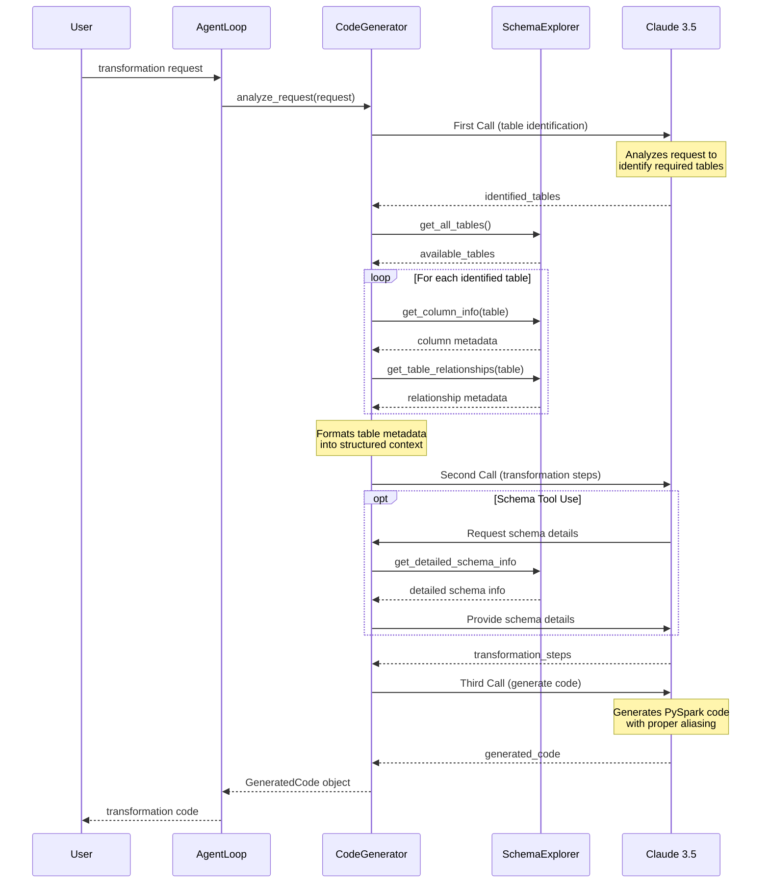

# Autonomous Transformation Agent

## Overview

This project implements an autonomous agent designed to transform data within a PostgreSQL database using Apache Spark.

## Features

*   **Natural Language Processing:** Translates plain English requests into executable Apache Spark code using Anthropic's Claude 3.5 Sonnet.
*   **Spark Code Generation:** Dynamically generates PySpark code tailored to the user's request and the database schema.
*   **Autonomous Execution Loop:**
    *   Executes generated Spark code against a PostgreSQL database.
    *   Validates the results of the transformation.
    *   Automatically retries or attempts self-correction upon failure.
    *   Prompts the user for confirmation upon successful transformation.
*   **Read-Only Database Interaction:** Ensures data integrity by connecting to PostgreSQL in read-only mode.
*   **Schema Awareness:** Uses database schema information (including relationships and detailed column info via an optional tool) to generate more accurate code.
*   **Robust Logging:** Generates both human-readable logs (`logs/app.log`) and structured JSON logs (`logs/app.json.log`) compatible with the AgentTrace framework.
*   **Command-Line Interface:** Provides a simple CLI for submitting transformation requests and viewing results.

## Setup Instructions

1.  **Clone the Repository:**
    ```bash
    git clone https://github.com/h0n3yb/sierrabot.git
    cd sierrabot
    ```

2.  **Create and Activate Virtual Environment:**
    ```bash
    python3 -m venv venv
    source venv/bin/activate  # On Windows use `venv\Scripts\activate`
    ```

3.  **Install Dependencies:**
    ```bash
    pip install -r requirements.txt
    ```
4.  **PostgreSQL JDBC Driver:**
    *   Download the PostgreSQL JDBC driver JAR file (e.g., `postgresql-42.2.5.jar` or a compatible version).
    *   Place the JAR file in the root directory of the project or ensure Spark can find it (the current code expects it in the root).

5.  **Configure Environment Variables:**
    *   Create a `.env` file in the project root directory.
    *   Add the following variables, replacing the placeholder values:
        ```dotenv
        # PostgreSQL Connection Details
        POSTGRES_HOST=localhost
        POSTGRES_PORT=5432
        POSTGRES_DB=your_database_name
        POSTGRES_USER=your_readonly_user
        POSTGRES_PASSWORD=your_user_password

        # Anthropic API Key
        ANTHROPIC_API_KEY=sk-ant-api03-...

        # Spark Driver Memory (Optional, adjust as needed)
        SPARK_DRIVER_MEMORY=4g
        ```

6.  **Set Up PostgreSQL Database:**
    *   Ensure you have a PostgreSQL server running and accessible.
    *   Create the database specified in `POSTGRES_DB`.
    *   Create a read-only user specified in `POSTGRES_USER` with the corresponding password. Grant this user `CONNECT` privileges on the database and `SELECT` privileges on the relevant schemas/tables (e.g., the `app_data` schema used in the code).
    *   Create the necessary schemas (e.g., `app_data`) and tables that the agent will interact with. Populate them with sample data.

## Running the Agent (CLI)

Execute the agent from the project root directory using the following command structure:

```bash
python src/cli.py "<your natural language transformation request>" [OPTIONS]
```

**Example:**

```bash
# Basic request
python src/cli.py "Show me all customers from the 'app_data.customers' table who joined after January 1st 2023"

# Request with results displayed as a table
python src/cli.py "Calculate the total order amount per customer from 'app_data.orders' joined with 'app_data.customers'" --viz

# Request enabling the schema exploration tool for potentially better analysis
python src/cli.py "Find users whose status is 'active' in the 'app_data.user_status' table" --use-tool

# Run with debug logging enabled
python src/cli.py "List the top 5 products by sales volume from 'app_data.sales'" --debug --viz
```

**CLI Options:**

*   `--use-tool`: Enables an experimental schema exploration tool during the analysis phase, allowing the AI to request more specific schema details (like distinct values) if needed.
*   `--viz`: Displays successful results in a formatted table (using `tabulate`).
*   `--debug`: Enables `INFO` level logging to the console for more detailed output.

## Spark Code Generation Flow


