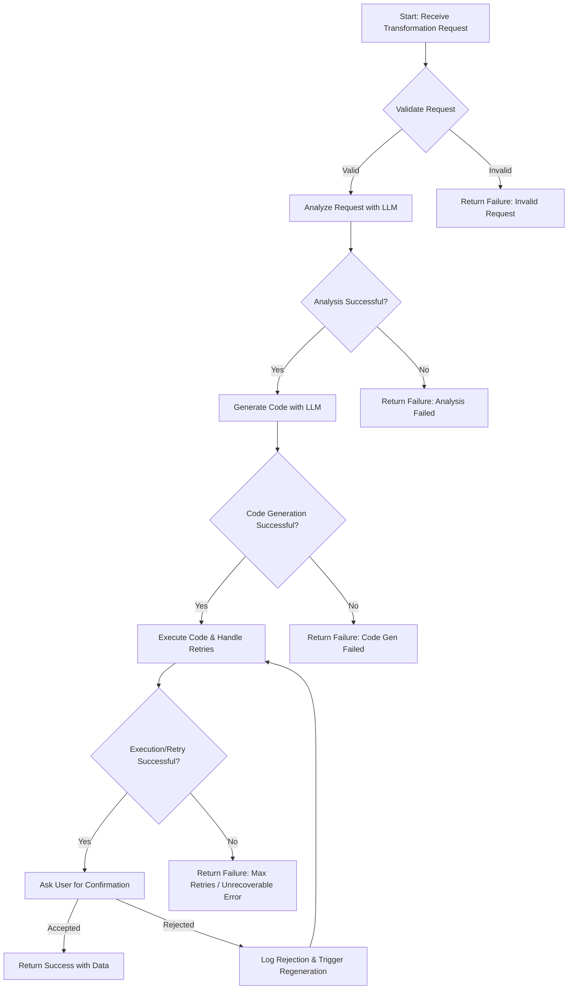

```mermaid
%% Agent Flow Diagram
flowchart TD
    A[Start: Receive Transformation Request] --> B{Validate Request}
    B -- Valid --> C[Analyze Request with LLM]
    B -- Invalid --> Z[Return Failure: Invalid Request]
    C --> D{Analysis Successful?}
    D -- Yes --> E[Generate Code with LLM]
    D -- No --> Z2[Return Failure: Analysis Failed]
    E --> F{Code Generation Successful?}
    F -- Yes --> G[Execute Code & Handle Retries]
    F -- No --> Z3[Return Failure: Code Gen Failed]
    G --> H{Execution/Retry Successful?}
    H -- Yes --> I[Ask User for Confirmation]
    H -- No --> Z4[Return Failure: Max Retries / Unrecoverable Error]
    I -- Accepted --> J[Return Success with Data]
    I -- Rejected --> K[Log Rejection & Trigger Regeneration]
    %% Loop back to execution
    K --> G
``` 