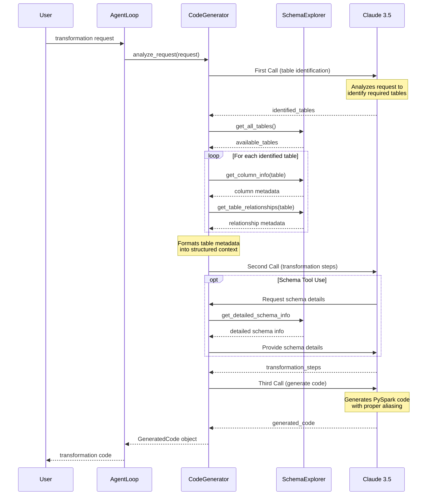

```mermaid
%% Code Generation Flow Diagram
sequenceDiagram
    participant U as User
    participant A as AgentLoop
    participant CG as CodeGenerator
    participant SE as SchemaExplorer
    participant LLM as Claude 3.5
    
    U->>A: transformation request
    A->>CG: analyze_request(request)
    
    %% Phase 1: Table Identification
    CG->>LLM: First Call (table identification)
    Note over LLM: Analyzes request to<br/>identify required tables
    LLM-->>CG: identified_tables
    
    %% Metadata Collection
    CG->>SE: get_all_tables()
    SE-->>CG: available_tables
    
    loop For each identified table
        CG->>SE: get_column_info(table)
        SE-->>CG: column metadata
        CG->>SE: get_table_relationships(table)
        SE-->>CG: relationship metadata
    end
    
    %% Phase 2: Transformation Planning
    Note over CG: Formats table metadata<br/>into structured context
    CG->>LLM: Second Call (transformation steps)
    
    opt Schema Tool Use
        LLM->>CG: Request schema details
        CG->>SE: get_detailed_schema_info
        SE-->>CG: detailed schema info
        CG->>LLM: Provide schema details
    end
    
    LLM-->>CG: transformation_steps
    
    %% Phase 3: Code Generation
    CG->>LLM: Third Call (generate code)
    Note over LLM: Generates PySpark code<br/>with proper aliasing
    LLM-->>CG: generated_code
    
    %% Return Results
    CG-->>A: GeneratedCode object
    A-->>U: transformation code
```
