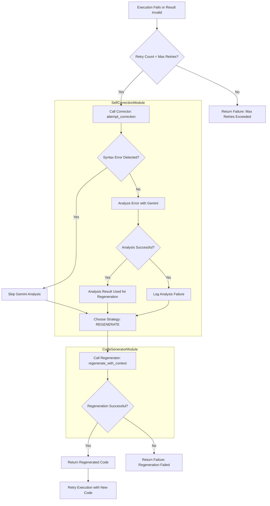

```mermaid
%% Error Correction Flow Diagram
flowchart TD
    A[Execution Fails or Result Invalid] --> B{Retry Count < Max Retries?}
    B -- No --> C[Return Failure: Max Retries Exceeded]
    B -- Yes --> D[Call Corrector: attempt_correction]
    D --> E{Syntax Error Detected?}
    E -- Yes --> F[Skip Gemini Analysis]
    E -- No --> G[Analyze Error with Gemini]
    G --> H{Analysis Successful?}
    H -- Yes --> I[Analysis Result Used for Regeneration]
    H -- No --> J[Log Analysis Failure]

    F --> K[Choose Strategy: REGENERATE]
    I --> K
    J --> K

    K --> L[Call Regenerator: regenerate_with_context]
    L --> M{Regeneration Successful?}
    M -- Yes --> N[Return Regenerated Code]
    M -- No --> O[Return Failure: Regeneration Failed]

    subgraph SelfCorrectionModule
        D
        E
        G
        H
        I
        J
        K
    end

    subgraph CodeGeneratorModule
        L
        M
    end

    N --> P[Retry Execution with New Code]
``` 